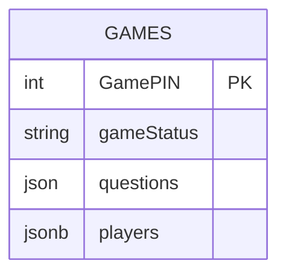
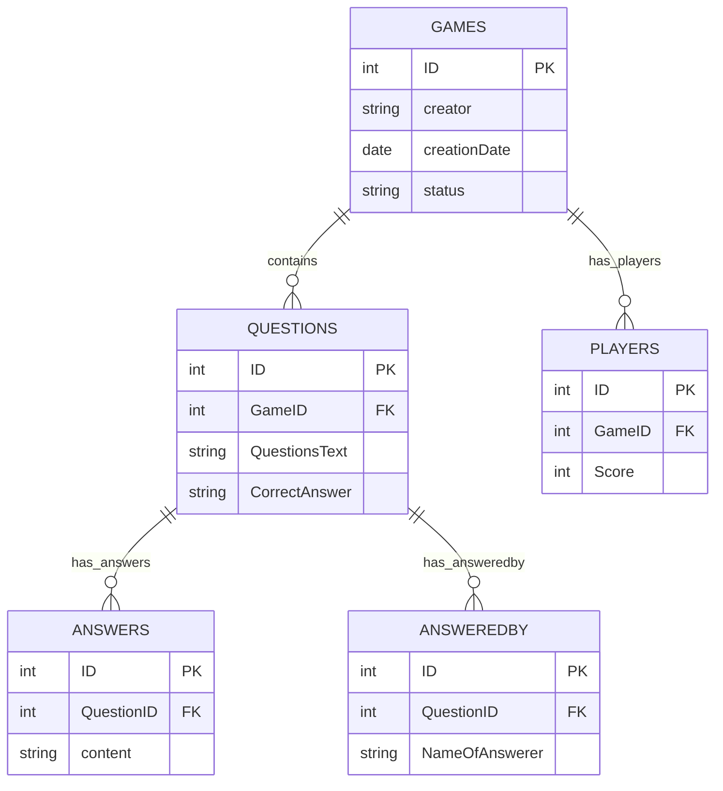

# DB Diagrams

## Current DB Diagram

```mermaid
    erDiagram
        GAMES {
            int GamePIN PK
            string gameStatus
            json questions
            jsonb players
        }
```

## Goal MVP DB Diagram

```mermaid
    erDiagram
    GAMES {
        int ID PK
        string creator
        date creationDate
        string status
    }
    QUESTIONS {
        int ID PK
        int GameID FK
        string QuestionsText
        string CorrectAnswer
    }
    ANSWERS {
        int ID PK
        int QuestionID FK
        string content
    }
    ANSWEREDBY {
        int ID PK
        int QuestionID FK
        string NameOfAnswerer
    }
    PLAYERS {
        int ID PK
        int GameID FK
        int Score
    }

    GAMES ||--o{ QUESTIONS : contains
    QUESTIONS ||--o{ ANSWERS : has_answers
    QUESTIONS ||--o{ ANSWEREDBY : has_answeredby
    GAMES ||--o{ PLAYERS : has_players


```
