# DaKahootClone

The best ever kahoot clone.

A project by [RezHackXYZ](https://rezhack.xyz) for [Neighborhood](https://neighborhood.hackclub.com/)

(⚠️ This project is one of a bunch of tools that are part of a larger project.
See the [original project repo](https://github.com/RezHackXYZ/ClassRoomStuff) for the full collection.)

👉 **[Try It Now](https://kahoot-clone-rezhackxyz.vercel.app/)**

---

## Tech Stack

- SvelteKit
- JavaScript
- Supabase

## Current DB Diagram

```mermaid
    erDiagram
    GAMES {
        int ID PK
        string creator
        date creationDate
        string status
    }
    QUESTIONS {
        int ID PK
        int GameID FK
        string QuestionsText
        string CorrectAnswer
    }
    ANSWERS {
        int ID PK
        int QuestionID FK
        string content
    }
    ANSWEREDBY {
        int ID PK
        int QuestionID FK
        string NameOfAnswerer
    }
    PLAYERS {
        int ID PK
        int GameID FK
        int Score
    }

    GAMES ||--o{ QUESTIONS : contains
    QUESTIONS ||--o{ ANSWERS : has_answers
    QUESTIONS ||--o{ ANSWEREDBY : has_answeredby
    GAMES ||--o{ PLAYERS : has_players
```

